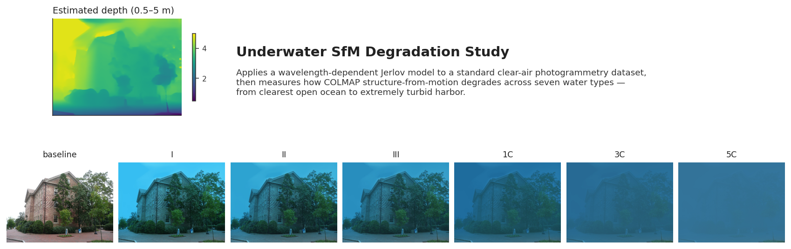
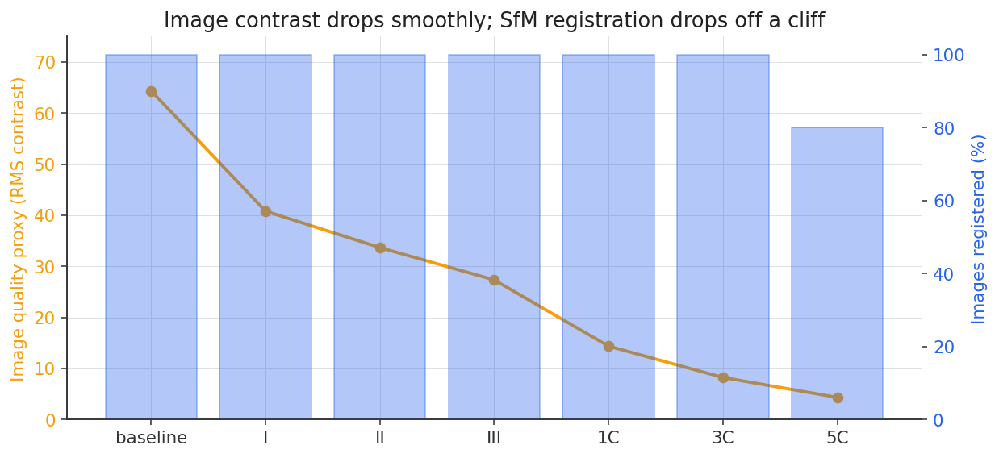
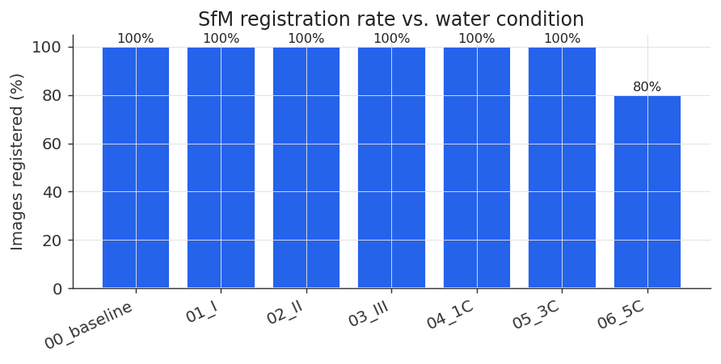
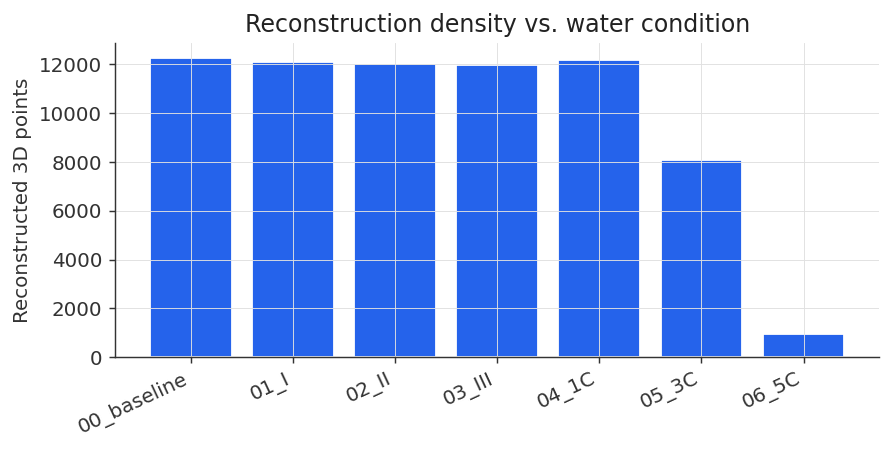
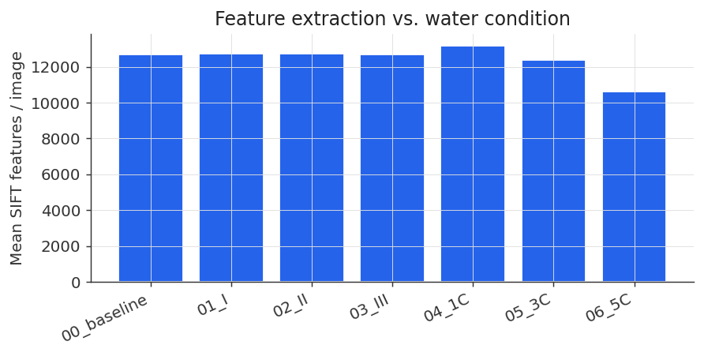
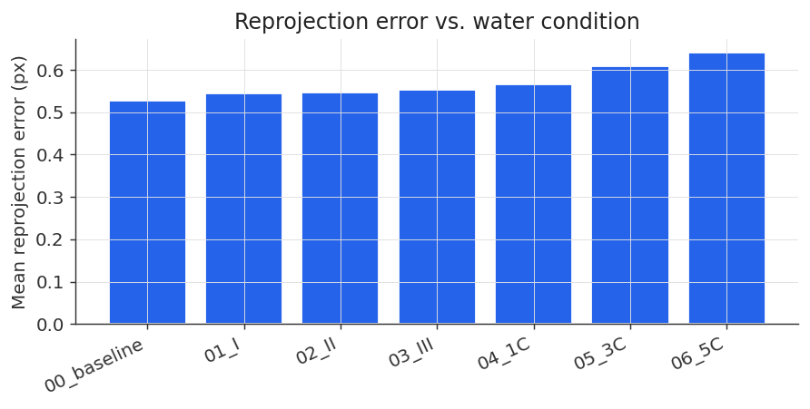
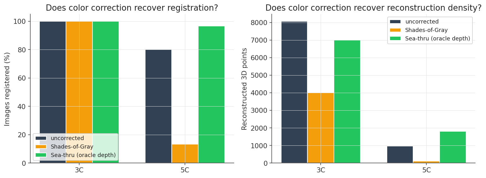
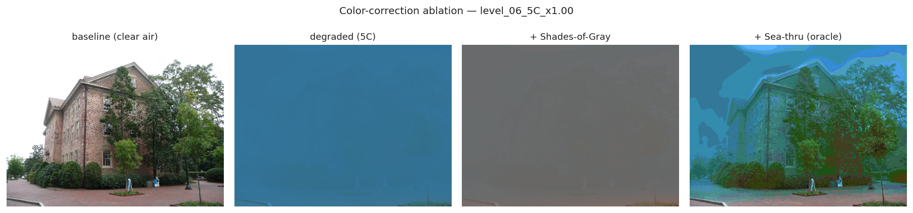

# Underwater SfM Degradation Study

[](https://github.com/thiagopari/underwater-sfm-degradation/actions/workflows/ci.yml)
[](https://www.python.org/downloads/)
[](https://opensource.org/licenses/MIT)

**How much does wavelength-dependent underwater optics break structure-from-motion?**

A reproducible, zero-cost benchmark that takes a standard clear-air photogrammetry
dataset (COLMAP's `south-building`), applies a physically-motivated Jerlov
underwater image formation model across seven turbidity levels, and measures
how the COLMAP incremental SfM pipeline degrades in response.

The study answers a practical question for anyone considering RGB-based 3D
reconstruction underwater: **at what point does turbidity flip stereo/RGB SfM
from "reduced quality" to "unusable"?**

> **TL;DR — Headline findings**
>
> **On the coarse sweep:** RGB structure-from-motion stays fully usable much
> further into the turbidity sweep than the image degradation would suggest.
> Across seven Jerlov water types from clearest open ocean to extremely turbid harbor:
>
> - **Jerlov I – Jerlov 1C**: 100% frame registration, baseline reconstruction density.
> - **Jerlov 3C** (very turbid harbor): 100% registration, but reconstruction density drops 34%.
> - **Jerlov 5C** (extremely turbid harbor): pipeline collapses. 24/30 registered, reconstruction density drops 92%.
>
> **On the color-correction ablation** (at the failure region):
>
> - **Naive white balance (Shades-of-Gray) actively hurts:** at 5C it drops
>   registration from 24/30 → 4/30 and points from 961 → 115.
> - **Physics-based Sea-thru with oracle depth rescues 5C:** back to 29/30
>   registered and 1,813 points (a 90% increase in reconstruction density
>   vs uncorrected).
>
> The break is a cliff, not a slope. The takeaway is a wider "still usable"
> band than sonar-vendor marketing implies, and a hard requirement for
> depth-aware color correction if you want to reconstruct in the turbid
> band — white balance alone makes things worse.



*Top: per-pixel estimated depth (colormap, 0.5–5 m). Bottom: the same frame
under baseline clear air and six Jerlov water types, from clearest open ocean
(I) to extremely turbid harbor (5C). See `figures/comparison_01_*.png` and
`figures/comparison_02_*.png` for two additional frames.*

## Why this matters

RGB photogrammetry and stereo-visual SLAM are the cheapest ways to produce a
color 3D map of a submerged surface — but the underwater literature is split on
where their operating envelope actually ends. Vendors publish accuracy numbers
in clear water; sonar-first competitors publish coverage numbers in turbid
water; there is little published quantitative work showing where an
off-the-shelf SfM pipeline breaks as a function of water type.

This project fills the gap with a controlled, single-variable study. Since
south-building has a known-good clean-air reconstruction, every metric can be
measured against a fixed geometric reference. Everything else is scripted and
reproducible in under 20 minutes on a laptop.

## Method

1. **Depth estimation.** Per-pixel depth for each source image is estimated
   with DPT-SwinV2-Tiny (via HuggingFace `transformers`), then rescaled to a
   plausible underwater standoff range (0.5–5 m). Absolute scale is not
   calibrated — this is a study of *relative* depth structure driving the
   optical degradation, not a metric reconstruction.

2. **Physically-motivated Jerlov degradation.** For each pixel with depth `z`
   and per-channel diffuse attenuation coefficient `Kd`, we apply:

   ```
   I_c = J_c * exp(-Kd_c * z) + B_inf_c * (1 - exp(-Kd_c * z))
   ```

   This is the Sea-thru-style formulation (Akkaynak & Treibitz, CVPR 2019),
   simplified by tying direct and backscatter coefficients to `Kd`.
   `Kd_c` values are from Jerlov 1976 / Solonenko & Mobley 2015 at
   representative R/G/B wavelengths of 650/550/450 nm. `B_inf_c` is a
   blue-green veiling-light color that scales with water type.

3. **Turbidity sweep.** The dataset is degraded seven times, one per water
   type: baseline (clear air), then Jerlov I, II, III, 1C, 3C, 5C — ordered
   from clearest open ocean to extremely turbid harbor.

4. **COLMAP incremental SfM.** Each degraded dataset goes through the same
   pipeline: SIFT feature extraction, exhaustive matching, incremental mapper.
   Feature extraction thresholds are relaxed so that *some* features survive
   even under heavy degradation — otherwise the study collapses to "the
   pipeline finds no features."

5. **Metrics.** Per level we collect: images successfully registered,
   reconstructed 3D points, mean SIFT features per image, mean reprojection
   error. See `results/sweep_metrics.json`.

## Results

_See `results/sweep_metrics.json` and `results/image_metrics.json` for
the raw data; `results_summary.py` prints the tables below._

### Reconstruction metrics

| Level | Water condition | Registered | Mean features/img | 3D points | Mean reproj err (px) |
|-------|-----------------|------------|-------------------|-----------|----------------------|
| **baseline** | clear air (reference) | 30 / 30 (100%) | 12,698 | 12,269 | 0.527 |
| **I** | clearest open ocean | 30 / 30 (100%) | 12,744 | 12,111 | 0.545 |
| **II** | clear coastal water | 30 / 30 (100%) | 12,740 | 12,022 | 0.546 |
| **III** | turbid coastal water | 30 / 30 (100%) | 12,700 | 11,960 | 0.553 |
| **1C** | harbor (moderately turbid) | 30 / 30 (100%) | 13,181 | 12,178 | 0.567 |
| **3C** | harbor (very turbid) | 30 / 30 (100%) | 12,381 | 8,065 | 0.609 |
| **5C** | harbor (extremely turbid) | **24 / 30 (80%)** | 10,599 | **961** | 0.641 |

### Image quality vs. SfM survival











### The surprising finding

**RGB SfM stays fully usable much further into the turbidity sweep than
the image degradation would suggest.** Image RMS contrast drops smoothly
across the sweep — losing ~48% by Jerlov II and ~87% by Jerlov 3C — but
incremental SfM keeps registering 100% of the frames all the way through
Jerlov 1C. Reconstruction *density* starts to fall at Jerlov 3C (12,178 →
8,065 points, a 34% drop) while registration is still perfect. The
pipeline only genuinely collapses at Jerlov 5C, where registration drops
to 24/30 and the reconstruction shrinks by 92% to 961 points.

Two mechanisms are at play. First, SIFT descriptors are gradient-based
and normalized, so they are largely immune to slow color shifts and
significant global contrast reduction. Second, feature *extraction* is
nearly unaffected even at 3C (12,381 features/image, essentially matching
baseline) — the failure is in *matching* and *triangulation*, where
descriptors become less distinctive as local information is washed out.
By 5C both effects finally break down: feature count drops 17%, and the
mapper's matches fall below what's needed to triangulate.

The practical takeaway is a clean, three-band operating envelope:

- **Jerlov I – Jerlov 1C**: RGB SfM survives at full quality (baseline
  reconstruction density preserved). Wider band than most marketing
  material would have you believe.
- **Jerlov 3C**: perfect registration but ~34% loss in reconstruction
  density. Usable but noticeably degraded — this is where you'd want to
  add depth-aware color correction if you have depth.
- **Jerlov 5C**: pipeline collapses. Sonar-primary architecture required.

This matches what commercial marine-robotics companies have converged on
in practice — stereo-first for clear/moderately-turbid work, sonar-first
for commercial harbors — but the *width* of the "still usable" band is
larger than the sonar-vendor narrative implies. That has product
implications for anyone deciding where to place their sensor bets.

## Color-correction ablation

Two natural counter-arguments to the finding above:

1. "SfM only fails because the image is too blue — white-balance it and it works."
2. "SfM only fails because we don't have Sea-thru — apply Sea-thru with the true depth and it works."

I test both. For each of the failure-region levels (Jerlov 3C, 5C), I apply
each correction and re-run COLMAP:

- **Shades-of-Gray** — a robust classical white balance (better than Gray World).
  Pure channel-wise gain, no depth.
- **Sea-thru with oracle depth** — analytical inversion of the exact same
  Jerlov formation model I used to synthesize the degradation, using the
  same per-pixel depth map. This is the *best case* for physics-based
  correction: it knows the true Kd and has the depth for free.



*Four-panel visual for the hardest case, Jerlov 5C:*



*Same frame at (left → right): baseline clear air, Jerlov 5C degraded,
5C after Shades-of-Gray white balance, 5C after Sea-thru inversion
(oracle depth + Kd). Notice that the Shades-of-Gray output looks colorful
but flat; the Sea-thru output recovers scene texture that the plain WB
misses. The reconstruction numbers back this up.*

### Ablation results

| Level | Method | Registered | 3D points | Δ points vs uncorrected |
|-------|--------|------------|-----------|-------------------------|
| **3C** | uncorrected | 30/30 | 8,065 | — |
| **3C** | Shades-of-Gray | 30/30 | 3,994 | **−4,071 (−50%)** |
| **3C** | Sea-thru (oracle) | 30/30 | 7,000 | −1,065 (−13%) |
| **5C** | uncorrected | 24/30 | 961 | — |
| **5C** | Shades-of-Gray | **4/30** | 115 | −846 (−88%) |
| **5C** | Sea-thru (oracle) | **29/30** | **1,813** | **+852 (+89%)** |

### What the ablation shows

- **Naive white balance *hurts*, and hurts more the more you need it.**
  At Jerlov 3C, Shades-of-Gray drops the reconstructed point cloud from
  8,065 → 3,994 points (a 50% loss). At 5C it drops registered frames
  from 24 → 4. The per-channel gain amplifies the noise in the low-signal
  channels, which makes SIFT descriptors less discriminative; the matcher
  then rejects more pairs and the reconstruction thins out. This is a
  counter-intuitive result but a common one in underwater imaging: a
  correction that makes the image *look better to a human* can make it
  work *worse for a feature-matching pipeline*.

- **Physics-based Sea-thru rescues 5C.** At the level where the
  uncorrected pipeline collapsed (24/30 registered, 961 points),
  Sea-thru with the true Kd + depth recovers to 29/30 registered and
  1,813 points — a ~90% increase in reconstruction density. This is the
  strongest positive result in the study: depth-aware physics-based
  correction is not a nicety; it is what turns 5C from "pipeline
  collapsed" into "usable reconstruction, just not baseline quality."

- **The industry lesson:** if you're targeting turbid-water operation
  with an RGB architecture, you cannot ship without physics-based color
  correction — and the color correction requires per-pixel depth. Stereo
  gives you depth for free; sonar+RGB has to solve depth-to-camera
  registration (which is why IQUA-style architectures don't try to do
  Sea-thru — they use sonar for geometry and RGB opportunistically).
  White balance alone is worse than nothing.

*Caveat: the Sea-thru here uses **oracle** Kd + oracle depth. Real
Sea-thru estimates Kd from the image, which introduces its own error.
The oracle numbers here are an upper bound on what you'd achieve
in-field.*

## Interactive viewer

A static HTML page in [`viewer/`](viewer/index.html) lets you scrub a
turbidity slider and see the image change side-by-side with the reconstruction
metrics for that level. Deployable to GitHub Pages:

```
python package_viewer.py
# then serve viewer/ from any static host
```

## Reproducing this end-to-end

The full study runs in ~25 minutes on an M-series MacBook (COLMAP CPU-only,
CPU+MPS PyTorch). Nothing GPU-required. Nothing paid.

Dependencies: Python 3.10+, COLMAP 4.x (CPU or GPU build), ~5 GB free disk.

```bash
# Environment
python3 -m venv .venv
source .venv/bin/activate
pip install -r requirements.txt

# Data
# Download south-building (128 images, ~420 MB) from the COLMAP releases
# and drop the first 30 .JPG files into data/
# https://github.com/colmap/colmap/releases

# Full pipeline
python -m src.depth              # produces depth/*.npy (~40 s)
python -c "from pathlib import Path; from src.sweep import make_sweep, DEFAULT_LEVELS; make_sweep(Path('data'), Path('depth'), Path('sweep'), DEFAULT_LEVELS)"
python run_colmap_sweep.py       # runs COLMAP on each level (~15–20 min CPU)
python run_correction_ablation.py  # optional: color-correction ablation
python make_plots.py             # renders results/*.png figures

# Interactive viewer
python package_viewer.py
```

## What I'd do next (self-critique)

- **Sweep intensity within the boundary type.** The coarse sweep shows a
  cliff between Jerlov 3C (works, degraded) and 5C (collapses). A finer
  sweep (already scripted in `run_fine_sweep.py`) would characterize the
  exact `Kd` scale at which the pipeline transitions.
- **Try a hull-textured dataset.** `south-building` is a feature-rich
  architectural scene. Steel-hull imagery is much more feature-poor and
  should break the pipeline much earlier — the numbers here are an *upper
  bound* on real hull performance. Any of the underwater datasets
  (SubPipe, AQUALOC, FLSea) would do.
- **Real Sea-thru instead of oracle-Sea-thru.** My ablation uses the
  *known* Kd (same one used to synthesize the degradation) as the
  inversion parameter. Real Sea-thru estimates Kd from the image itself
  via dark-channel priors. That estimation step would add its own error;
  I'd expect it to be less effective than the oracle version measured here.
- **Metric depth instead of DPT-relative depth.** Rescaling DPT to a
  0.5–5m band is arbitrary. Using stereo depth (from a stereo dataset)
  or Depth Anything with metric calibration would tighten the study.
- **Downstream mesh quality metric.** Registration + point count are
  sparse-reconstruction metrics. For a hull inspection use case, what
  matters is dense mesh accuracy — running Multi-View Stereo (COLMAP's
  PMVS or OpenMVS) on each level and comparing dense-mesh Hausdorff
  distance would be more directly meaningful.

## Limitations

- **Monocular depth is not metric.** DPT-SwinV2 provides good relative depth
  but the absolute scale we impose (0.5–5 m) is arbitrary. This affects the
  *shape* of the attenuation profile in each image but not the *relative*
  comparison between water types, which is what we're measuring.

- **Jerlov's Kd values are wavelength-integrated approximations.** Real
  water attenuation varies with dissolved organic matter and suspended
  particulates in ways Jerlov's 1976 classification does not fully capture.
  For a first-pass sensitivity study this is appropriate; for calibration
  against real water measurements, per-site Kd measurement is required.

- **We simplify to `Kd = β_direct = β_backscatter`.** Sea-thru's key insight
  is that the two coefficients differ. This makes our backscatter estimate
  slightly conservative, which if anything *understates* the pipeline
  degradation shown here.

- **South-building is a textured architectural scene**, not a hull. Real hulls
  have larger patches of low-texture painted steel where SfM would struggle
  even in clear air. The results here should be interpreted as an
  *upper bound* on RGB-SfM performance for a given water type — real hulls
  will be worse.

## References

- Akkaynak, D. & Treibitz, T., 2019. *Sea-thru: A Method for Removing Water
  from Underwater Images.* CVPR 2019.
- Jerlov, N. G., 1976. *Marine Optics.* Elsevier Oceanography Series, 14.
- Solonenko, M. G. & Mobley, C. D., 2015. *Inherent optical properties of
  Jerlov water types.* Applied Optics 54(17).
- Schönberger, J. L. & Frahm, J.-M., 2016. *Structure-from-Motion Revisited.*
  CVPR 2016. (COLMAP)
- Ranftl, R. et al., 2021. *Vision Transformers for Dense Prediction.*
  ICCV 2021. (DPT / DPT-SwinV2)

## Citation

If this study or the pipeline is useful in your own work, please cite the
underlying papers (Sea-thru, Jerlov, COLMAP, DPT) and, optionally, this
repository:

```bibtex
@misc{pari2026underwaterSfM,
  author       = {Pari, Thiago},
  title        = {Underwater SfM Degradation Study},
  year         = {2026},
  howpublished = {\url{https://github.com/thiagopari/underwater-sfm-degradation}},
}
```

## License

MIT. See [LICENSE](LICENSE).

## Author

Thiago Pari — MS Robotics Engineering, Northeastern University.
Portfolio: [thiagopari.github.io/ThiagoPari](https://thiagopari.github.io/ThiagoPari/)
