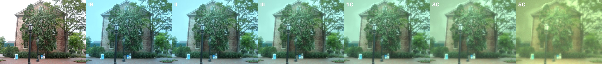
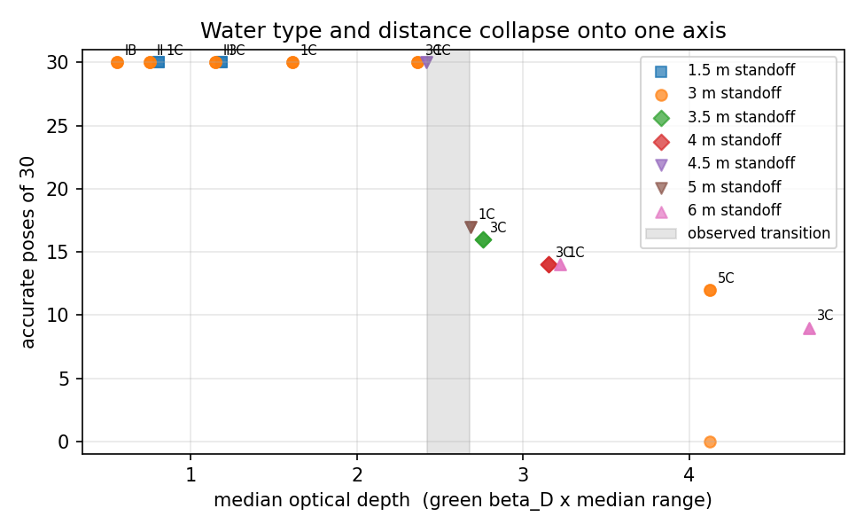
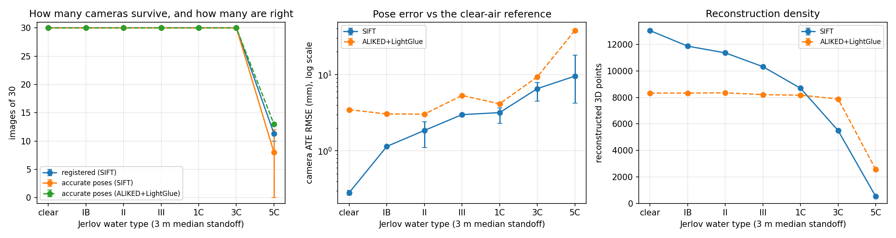
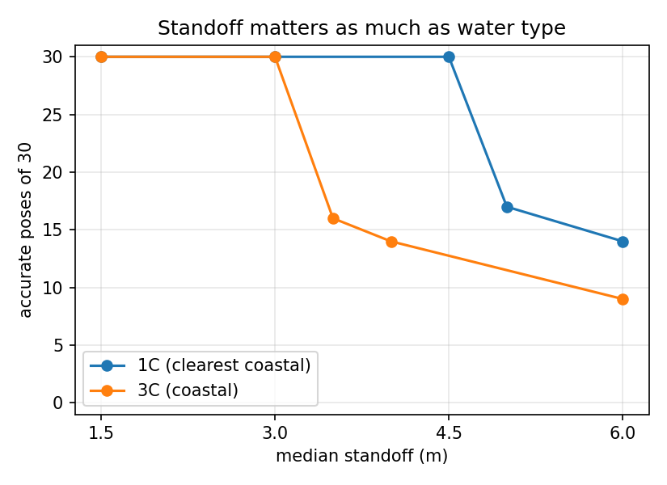
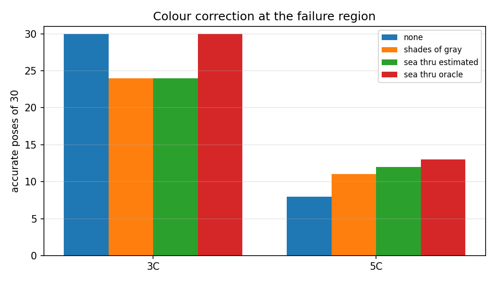

# Underwater SfM Degradation Study

[](https://github.com/thiagopari/underwater-sfm-degradation/actions/workflows/ci.yml)
[](https://www.python.org/downloads/)
[](https://opensource.org/licenses/MIT)

**When does off-the-shelf structure-from-motion stop recovering camera poses underwater, and what controls it?**

**[Live interactive viewer](https://thiagopari.github.io/underwater-sfm-degradation/)**: scrub through the water types and see the reconstruction metrics change.

A controlled simulation study. It renders COLMAP's `south-building` photos
(30 frames) as if they were taken underwater, using measured optical properties
of the Jerlov water types, a spectral image-formation model and a camera noise
model. It then runs COLMAP on each set and scores the recovered camera poses
against the clear-air reconstruction. 64 seeded COLMAP runs on a laptop CPU.

> **Scope.** One terrestrial scene, synthetic water, ambient light only. The
> numbers describe this pipeline and this sensor model, not a guarantee for a
> real vehicle. See [Limitations](#limitations).
> This is **v2**. v1 overstated its conclusions; [WRITEUP.md](WRITEUP.md) lists
> what was wrong and what changed.



## Findings

1. **Three regimes, ordered by optical depth.** Water type and distance combine
   into the median optical depth *τ = β<sub>D</sub> × depth* (green channel).
   With SIFT and the baseline sensor:
   - **τ ≤ 2.4: one complete map.** All 30 cameras in a single model, every
     camera within 25 mm of the clear-air pose.
   - **τ ≈ 2.7: the map splits.** 1C at 5 m (τ 2.69) and 3C at 3.5 m (τ 2.76)
     still register 29–30 cameras, but as two disconnected sub-models of about
     16 + 14. The split falls at the same place in every seed, so it is a weak
     overlap link in this image set giving way first.
   - **τ ≥ 3.2: cameras are lost.** 1C at 6 m, 3C at 4 m and 5C at 3 m keep one
     model with 10–14 cameras.

   The collapse onto τ is expected rather than discovered: in this model range
   enters the image only through *c·r*, and changing the standoff rescales the
   same scene. What the study measures is **where** the transition sits, how
   sharp it is, and what moves it.
2. **The transition depends on the camera and on the haze, so τ ≈ 2.4 is not a
   constant.** Four times the photon budget (20,000 e⁻) brings 1C at 5 m back to
   one complete map, and a quarter (1,250 e⁻) drops 3C at 3 m to 14 cameras.
   Raising the veiling light 10× (still under a tenth of the ambient target
   brightness) splits 3C at 3 m, and 30× drops it to 16 cameras. Since the
   single-scattering veiling estimate is probably low (see Limitations), treat
   τ ≈ 2.4 as an optimistic bound for this sensor.
3. **In practice, range matters as much as water type.** At a 3 m median
   standoff every type up to Jerlov 3C (coastal) gives a complete map, and 5C
   (turbid coastal) keeps 10–12 cameras. At 1.5 m, 3C gives 9,500 points. At
   6 m, even 1C (the clearest coastal type) keeps only 14.
4. **SfM fails by fragmenting and dropping cameras, not by getting them wrong.**
   In 62 of 63 runs, every camera COLMAP kept is within 10 cm and 2° of the
   reference after alignment. Camera ATE rises smoothly from 0.3 mm (clear-air
   replicates) to 6.5 mm at 3C (3 m).
5. **Point density degrades gradually, long before the map breaks.** 13.0k
   points in clear air, 8.7k at 1C and 5.5k at 3C (3 m). Density tracks the
   auto-exposure gain (2.5× in IB up to 44× in 5C), which sets the shot noise.
6. **Colour correction does not move the transition.** At 5C, uncorrected
   images keep 10–12 cameras, white balance 11–12, Sea-thru with *estimated*
   parameters 12, and an oracle that knows the true water 13. At 3C, white
   balance and estimated Sea-thru each split the map in one of two seeds (all 30
   cameras still registered). Once noise has swamped the detail, re-colouring
   the image cannot bring it back. (v1 reported the opposite, because its model
   had no noise.)
7. **Learned features keep more structure, not more cameras.** COLMAP 4's
   built-in ALIKED + LightGlue keeps 7.9k points at 3C and 2.6k at 5C (SIFT:
   5.5k and 0.5k). It registers 14 cameras at 5C against SIFT's 10–12, at about
   6× the CPU time. Its clear-air pose error is higher (3 mm), partly because
   the reference model was built with SIFT.



## Method

**Scene and depth.** 30 frames of COLMAP's south-building at 1600 × 1200. A
clear-air COLMAP run (seed 0) is the reference. DPT-SwinV2 depth maps are fitted
to the reference's sparse depths per image (scale and shift in inverse depth,
RANSAC; 82% inliers, 2.7% median depth error). One global scale sets the median
scene depth to the chosen standoff, so every view agrees on range.
[`src/depth_align.py`](src/depth_align.py)

**Water.** Absorption *a(λ)* and scattering *b(λ)* for Jerlov IB, II, III, 1C,
3C and 5C, 400–700 nm, are the measured values of Williamson & Hollins (2022)
([`src/data/`](src/data/jerlov_iop_williamson2022.csv)). Per wavelength and per
pixel range *r* ([`src/optics.py`](src/optics.py)):

```
E(λ)      = D65(λ) · exp(-K_d(λ) · d_amb)               ambient light at 5 m depth
direct    = ρ · E(λ) · exp(-c(λ) r)                      c = a + b
forward   = blur(ρ) · E(λ) · exp(-c r) · (exp(η b r) − 1)  small-angle forward scatter
veiling   = b_b(λ) E(λ) / (2 c(λ)) · (1 − exp(-c r))    single-scattering path radiance
```

with *b<sub>b</sub>* = 0.01*b* (open ocean) or 0.02*b* (coastal),
*K<sub>d</sub>* ≈ 1.0395 (*a* + *b<sub>b</sub>*)/0.85 (Gordon 1989), η = 0.5 and a
0.5° blur. Each camera channel integrates these against a Gaussian spectral
sensitivity, white-balanced for daylight at the surface. Integrating over
wavelength makes the effective coefficients depend on range, as in Akkaynak &
Treibitz (2018); in these waters the direct and backscatter values differ by
only 1–8%. Effective green β<sub>D</sub>
at 3 m: IB 0.19, II 0.25, III 0.38, 1C 0.54, 3C 0.79, 5C 1.38 m⁻¹.

**Camera.** Auto-exposure gain (99th-percentile luminance → 0.9), Poisson shot
noise with 5,000 e⁻ for a surface-lit white target, 3 e⁻ read noise, 8-bit sRGB,
JPEG quality 92. Noise is re-drawn per seed.

**SfM and scoring.** COLMAP 4.0.4, CPU: SIFT (relaxed peak threshold 0.001,
8,192 keypoints) or ALIKED + LightGlue, exhaustive matching, incremental mapper,
seeded. Camera centres of the largest model are aligned to the reference with a
similarity transform (Umeyama); rotations are compared after the best
rotation-only alignment, and an alignment-free relative-rotation error is also
recorded. Reported per run: cameras in the largest model and in any sub-model,
number of sub-models, **accurate poses** (within 10 cm and 2°), camera ATE RMSE,
3D points. In practice the thresholds rarely bind (worst camera in a complete
map: 25 mm); the model structure is what changes.
[`src/geometry.py`](src/geometry.py)

**Corrections.** Shades-of-Gray white balance. A Sea-thru-style correction that
*estimates* backscatter from the darkest pixels per range bin and attenuation
from the range-binned mean (range assumed known, as from stereo). An oracle
that inverts the simulator with the true parameters, as an upper bound only.
[`src/color_correction.py`](src/color_correction.py)

## Results

Full tables: [`results/v2/summary.md`](results/v2/summary.md). Raw per-run records:
[`results/v2/runs.jsonl`](results/v2/runs.jsonl). Mean over seeds, (min–max) where runs differ.

**Water-type sweep, SIFT, 3 m median standoff, 3 seeds.** "Largest model" is
the biggest connected reconstruction; "any model" counts cameras registered in
any sub-model.

| Water | Largest model /30 | Any model /30 | Accurate /30 | ATE RMSE (mm) | 3D points | Gain |
|---|---|---|---|---|---|---|
| clear air (2 replicates) | 30 | 30 | 30 | 0.3 | 13,044 | 1.0× |
| IB average open ocean | 30 | 30 | 30 | 1.1 | 11,871 | 2.5× |
| II clear coastal / open ocean | 30 | 30 | 30 | 1.9 (1.1–2.4) | 11,365 | 3.1× |
| III turbid open ocean | 30 | 30 | 30 | 3.0 | 10,321 | 4.7× |
| 1C clearest coastal | 30 | 30 | 30 | 3.2 (2.3–3.7) | 8,691 | 7.0× |
| 3C coastal | 30 | 30 | 30 | 6.5 (4.5–7.9) | 5,493 | 13.5× |
| 5C turbid coastal | 11 (10–12) | 11 (10–12) | 11 (10–12) | 9.6 (4.2–18.1) | 515 | 43.8× |

**Standoff, SIFT, 2 seeds**: cameras in the largest model (any model)

| Water | 1.5 m | 3 m | 3.5 m | 4 m | 4.5 m | 5 m | 6 m |
|---|---|---|---|---|---|---|---|
| 1C | 30 | 30 | | | 30 | 17 (30) | 14 |
| 3C | 30 | 30 | 16 (29) | 14 | | | 10 |

**Colour correction, SIFT, 3 m, 2 seeds** (uncorrected: 3 seeds): cameras in the largest model

| Water | none | Shades-of-Gray | Sea-thru (estimated) | Sea-thru (oracle, upper bound) |
|---|---|---|---|---|
| 3C | 30 | 24 (18–30), all 30 registered | 24 (18–30), all 30 registered | 30 |
| 5C | 11 (10–12) | 12 (11–12) | 12 | 13 |

**Sensitivity, SIFT, seed 0**: cameras in the largest model (any model)

| Condition | baseline | veil ×10 | veil ×30 | 4× photons | ¼ photons |
|---|---|---|---|---|---|
| 3C @ 3 m (τ 2.36) | 30 | 16 (29) | 16 | 30 | 14 |
| 1C @ 5 m (τ 2.69) | 17 (30) | 16 (29) | 14 | 30 | 14 |


 

## Limitations

- **One scene, and it isn't a hull.** A textured building favours feature
  matching. Low-texture painted hulls will break earlier. Treat the τ ≈ 2.4
  transition as optimistic for inspection targets.
- **Ambient light only.** Vehicle-mounted lights change both the signal
  (falloff, hot spots) and the backscatter geometry, which usually dominates
  at close range in turbid water.
- **Simplified scattering.** The veiling light is a single-scattering estimate
  (b<sub>b</sub>E/2c) with no multiple scattering, so it is probably too weak: the
  water behaves more like a dark absorber than a haze. The sensitivity runs show
  that stronger veiling moves the transition earlier. Forward scatter uses one
  blur width, and the channels are Gaussian rather than a measured camera. A
  radiative-transfer or Monte Carlo path radiance is the next physics upgrade.
- **The sensor model sets the numbers.** The transition depends on photon budget
  and read noise. A bigger sensor or longer exposure moves it to larger τ.
- **Depth from DPT.** Aligned to COLMAP, but errors remain where DPT is wrong
  (2.7% median, more at depth edges). Sky is clamped to 20× the median depth.
- **No real underwater validation yet.** The obvious next step is FLSea or
  AQUALOC footage with ground-truth trajectories.
- **Seeds, not thousands.** 2–3 seeds per condition (1 for ALIKED and the
  sensitivity runs). A seed changes the noise draw and COLMAP's RNG, not the
  scene. Clear-air replicates put COLMAP's run-to-run pose floor at 0.3 mm.
- **Map splits are scene-specific.** Fragmentation happens at the same weak link
  in every seed. A different image set, or sequential rather than exhaustive
  matching, would split elsewhere.

## Reproduce

Needs Python 3.10+, COLMAP 4.x on `PATH` (CPU build is fine), about 3 GB of disk.
The full study is about 3.6 hours of active compute on an M-series MacBook
(SIFT runs take about 2.2 min, ALIKED runs about 13 min). The logged wall clock
is longer, because the laptop slept during several runs. Every stage is resumable; on macOS run it
under `caffeinate -i` on AC power so the machine does not sleep mid-run. 
```bash
make venv          # pinned requirements
make data          # download south-building, extract + SHA-256-verify 30 frames
make depth prep    # DPT depth maps, 1600 px working copies
make study         # reference, main, standoff, transition, aliked, ablation, sensitivity
make plots viewer  # results/v2/summary.md, figures/v2/, viewer/
make test          # 28 unit tests (also run in CI, with a render smoke test)
```

The v1 study is kept in [`legacy_v1/`](legacy_v1/) (`make legacy-v1`), with its
results in `results/v1/` and figures in `figures/v1/`.

## References

- Akkaynak, D. & Treibitz, T. (2018). *A Revised Underwater Image Formation Model.* CVPR.
- Akkaynak, D. & Treibitz, T. (2019). *Sea-thru: A Method for Removing Water from Underwater Images.* CVPR.
- Williamson, C. A. & Hollins, R. C. (2022). *Measured IOPs of Jerlov water types.* Applied Optics 61, 9951–9961. doi:10.1364/AO.470464. Tabulated via the [`jerlov`](https://zenodo.org/records/22492765) package (Apache-2.0).
- Jerlov, N. G. (1976). *Marine Optics.* Elsevier.
- Gordon, H. R. (1989). *Can the Lambert-Beer law be applied to the diffuse attenuation coefficient of ocean water?* Limnology and Oceanography 34(8).
- Umeyama, S. (1991). *Least-squares estimation of transformation parameters between two point patterns.* IEEE TPAMI 13(4).
- Schönberger, J. L. & Frahm, J.-M. (2016). *Structure-from-Motion Revisited.* CVPR. (COLMAP)
- Ranftl, R. et al. (2021). *Vision Transformers for Dense Prediction.* ICCV. (DPT)
- Shen, X. et al. (2023). *ALIKED.* IEEE TIM; Lindenberger, P. et al. (2023). *LightGlue.* ICCV.

## Citation

```bibtex
@misc{pari2026underwaterSfM,
  author       = {Pari, Thiago},
  title        = {Underwater SfM Degradation Study},
  year         = {2026},
  howpublished = {\url{https://github.com/thiagopari/underwater-sfm-degradation}},
}
```

## License

MIT. See [LICENSE](LICENSE).

## Author

Thiago Pari, MS Robotics, Northeastern University.
Portfolio: [thiagopari.github.io/ThiagoPari](https://thiagopari.github.io/ThiagoPari/)
